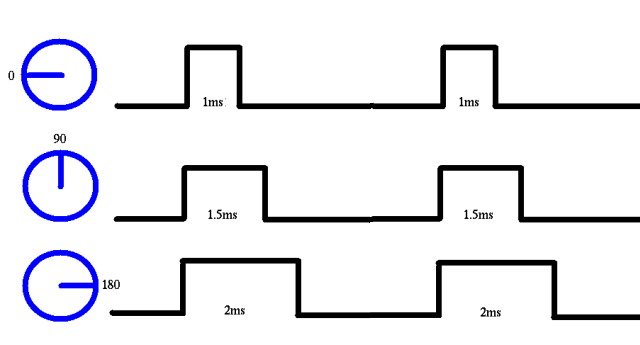

#Das RC Auto vorbereiten
Das Ferngesteuerte Auto *sollte* ein 1:10 Modellauto sein. Es existieren auch Ferngesteuerte Autos im Spielzeug Segment, allerdings ist deren
Motor **kein Servomotor**. Um ein RC Auto mit einem Raspberry Pi möglichst einfach zu verbinden, empfiehlt sich ein Servomotor.
So ein Spielzeug Auto hat 4Pins mit einem servo-ähnlichen Verhalten. Es wäre prinzipiell möglich auch das mit einem RaspberryPI
zu verbinden, allerdings ist so etwas dann eher im Elektrotechnik Fachgebiet.

## Der Servomotor
Der Servomotor eines Modellautos hat 3 Pins. Die 3 Pins sind

* Versorgungspannung
* Masse
* Signal/PWM

Wir haben einen **SunFounder PCA9685** als 12 Bit PWM Servo Driver verwendet. Vom Raspberry Pi müssen wir nun 4 Pins an den Servo Driver anschließen. Die 5V vom Pi an z.B Pin 2 muss an den VCC (+) Pol des Drivers angeschlossen werden.
Dann vom Pi die Masse z.B Pin 6 muss an die Masse (GND) vom Driver angeschlossen werden. Die Daten müssen aber auch vom Pi in den Motor fließen. Dafür verwenden wir einen I^2C Bus. Diesen Bus verwenden wir über die beiden Pins
SDL (Serial Data) und SCL (Serial Clock). Der SDl schickt die Daten und der SCL setzt den Taktimpuls. Der SDL hat eine 10Bit Adressierung.
Sowohl der Pi als auch der Driver haben einen SDL & SCL Anschluss Pin, die haben wir nun auch verbunden.
Als letzten Schritt muss der Motor noch mit dem Servotreiber verbunden werden. Ein echtes Modellauto hat immer einen wie oben beschriebenen 3 Pin Anschluss. Der Servo hat 3x16 Reihen Pins zur freien Verfügung, die jeweils
in PWM, V+ und GND (Masse) aufgeteilt sind. Der 3er Pin Block vom Motor muss nun einfach an eine dieser 16 Reihen eingesteckt werden.
Soweit fertig mit dem Verbinden.

##Kameramodul und Webserver

* Über die [IP-Adresse 192.168.2.125  und den Port 8887](http://192.168.2.125:8887) kann ein Webinterface aufgerufen werden, über dieses kann das Auto später bewegt werden und die Kamera eingesehen werden.
* Die Information (Vor, Zurück, Links und Recht) wird mittels JSON an den Webserver der vom Pi gehostet wird geschickt. Das Pi wartet darauf Daten zu bekommen, um anschließend das richtige PWM Signal zu senden.

##Abstraktionsebenen
* [Abstraktionsebene 1 - Grobe Gesamtübersicht](Ebene_1.pdf)
* [Abstraktionsebene 2 - Sicht Laptop - Webserver](Ebene_2_Laptop.pdf)
* [Abstraktionsebene 2 - Sicht RaspberryPi - Motor](Ebene_2_Laptop.pdf)
* [Abstraktionsebene 3 - Neuronales Netz](cnn_donkeycar2.pdf)
